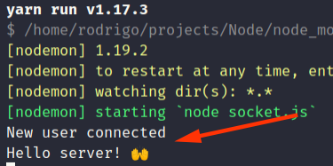
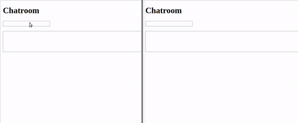

# Introduction

> > Node.js was created with a non-blocking model in mind when I / O operations are performed. When we talk about non-blocking model, we need to talk about the traditional development model using traditional languages ​​.... If you are developing with languages ​​like Java or C # without using parallelism and asynchronous features, each line runs only when the previous line of code has finished executing. Each line “blocks” the execution of the subsequent line until it finishes its execution. Now, in the context of web applications, this can be a problem. When a server receives a request from a client, when performing an I / O operation, processing is stalled. This means that when operations such as disk read or database query are performed, requests from other clients are queued. After processing is completed and answered to the first customer, the next customer is served. The more requests, the longer the queue gets, and the slower the response gets.
> >
> > In the Node.js nonblocking model, I / O operations do not block serving to other clients. While a disk read is being done, Node.js is already serving the next clients in the queue, taking advantage of the processor's potential, thus preventing some of its power from being idle.
> > _Source: TreinaWeb_

# Working with modules

In Node.js is very important to know how to work with modularizations, mainly because our code will be more organized.

In order to make our JS code be IMPORTABLE, it is necessary to uso the follow code:

```javascript
const Dog = {
  name: "Rex",
  bark: () => {
    console.log("woof!");
  }
};

module.exports = Dog; // 👈 this is the command I've told
```

And within the file (app.js) which will import it, we implement as bellow:

```javascript
Dog = require("./dog"); // is not necessary to put .js (only for JS file)
console.log(Dog.name);
Dog.bark();
```

Run `node app.js`

# Event emitters

Javascript itself is event driven. Event could be an access to database, opening a file, requesting at some external API, and so on.

In this approach we will learn how to create an event. We going to import:

```javascript
var EventEmitter = require("events");
var emitter = new EventEmitter();
```

In order to prepare our Emitter starts to LISTEN with `on('event_name', callback_function())`:

```javascript
emitter.on("my_event", function() {
  // what should happen when 'my_event' is executed
  console.log("my event");
});
```

But, how could we make this `my_event` be executed? Remember, our code is LISTENING for this specified event called `my_event`. We will make it with `emitter.emit()` function:

```javascript
emitter.emit("my_event");
```

Execute `node event.js` and you will realize that `my_event fired` was displayed in console.

### Setting params

We could add params in order to make it more dynamic:

```javascript
emitter.on("my_event", (...number) => console.log(number));

emitter.emit("my_event", 123, 321, 12, 4);
```

### Inharitance

We could also create other objects and make it inheritance the behavior from some event emitter:

```javascript
class Dog extends EventEmitter {
  bark() {
    console.log("woof woof!");
  }
}

var Rex = new Dog();

Rex.on("bark_please", Rex.bark);

Rex.emit("bark_please");
Rex.emit("bark_please");
Rex.emit("bark_please");
```

You can make the event stops to listen to the specified event:

```javascript
// class Dog (...same as above)
Rex.emit("bark_please"); // shows     ⬇ name of the function obliged
Rex.removeListener("bark_please", Rex.bark);
Rex.emit("bark_please"); // will not show
Rex.emit("bark_please"); // will not show
```

**Why do we need inform the name of the function (`Rex.bark`) within `removeListener()`?**. Because with the same event we could create different functions:

```javascript
var EventEmitter = require("events");

var emitter = new EventEmitter();

class Dog extends EventEmitter {
  bark() {
    console.log("woof woof!");
  }

  sleep() {
    console.log("ZZZzzzzz...");
  }
}

var Rex = new Dog();

Rex.on("bark_please", Rex.bark);
Rex.on("bark_please", Rex.sleep);

Rex.emit("bark_please");
// > woof woof!
// > ZZZzzzzz...
Rex.removeListener("bark_please", Rex.bark); // stopping only bark, sleep continues
Rex.emit("bark_please");
// > ZZZzzzzz...
Rex.emit("bark_please");
// > ZZZzzzzz...
```

### Executing evente once

Till now our event might be fired every time we want, however if we implement like bellow:

```javascript
// Rex.on("bark_please", Rex.bark);
Rex.once("bark_please", Rex.bark);

Rex.emit("bark_please"); // woof woof!
Rex.emit("bark_please"); // not displays
```

# Handling files - write and read

Node.js has a nattive module called **fs (file system)**:

```javascript
const fs = require("fs");
```

Let's create a new file called _file_name.txt_ and add some content within it:

```javascript
// the function bellow is asynchronous, that's why we need a callback function
// which receives an error variable (indicating errors)
fs.writeFile("file_name.txt", "Content put here!!!", function(err) {
  if (err) {
    console.error(err);
  } else {
    console.log("File created");
  }
});
```

Now let's read this created file:

```javascript
fs.readFile("file_name.txt", function(err, data) {
  if (err) {
    console.error(err);
  } else {
    console.log(data.toString());
  }
});
```

👉 It is not necessary to close files when we are handling it (e.g., PHP)

Another useful method from `fs` is `appendFile('file.txt', 'extra content')` which will append `extra content` into the end of `file.txt`.

Till here we are dealing with asyNCHRONOUS methods, however `fs` has SYNCHRONOUS methods adding **Sync** in the end of the name of the method:

```javascript
//          👇
fs.readFileSync(...); // callback is not necessary
```

The problem is that the rest of the code bellow of this `readFileSync()` will be executed only after it finish the process of reading file.

# Error handling

When our app has some error, generally it will crash and stops to execute the next lines.

We could force an error - and crash the application - executing this:

```javascript
throw new Error("some error occurred here!!!!!");
```

And the next code WILL NOT BE executed!

> _There are many procedures in our code implementations which are error prone. E.g., requesting an API, consulting database, reading/opening files, and so on. And in these codes WE MUST to implement a more elegant errors handling and keep our application running._

We can treat these errors without crash our application using `Error` object (JS native) with the code bellow:

```javascript
const err = new Error("A standard error");
console.log(err);
```

It will generate an error at the console, however it will not crash the app, keeping our code running till the end.

If you want to custom the functionallity of these errors, we can create a class which extends from `Error` object:

```javascript
class TreatErrors extends Error {
  constructor(args) {
    super(args);
    this.name = "Elegant error:";

    // you could save this error in a log, use Sentry, and so on
  }
}

console.log(new FancyError("Error here mannn!!"));
```

# Promises

Look t the code bellow which it is reading the content from `file_name.txt`, appending this content into `another_file.txt` and finally reading the latest file:

```javascript
read("my_file.txt", function(data1, callback1) {
  console.log(data1);
  callback1("1111111", function(data2, callback2) {
    console.log(data2);
    callback2("2222222", function(data3, callback3) {
      console.log(data3);
      callback3("3333333", function(data4, callback4) {
        console.log(data4);
      });
    });
  });
});
```

Note that the code bellow we are incurring in a **callback hell** 😈, which is very difficult to mantain.

In order to avoid callback hell, we will use Promises:

`$ npm install promise`

And import it:

`const Promise = require('promise');`

Ok, let's read a file - which is asynchronous - using promises:

```javascript
const fs = require("fs"),
  Promise = require("promise");

function read(file) {
  // we starts to use Promises like bellow:
  return new Promise(function(fulfill, reject) {
    fs.readFile(file, function(err, data) {
      if (err) {
        reject(err);
      }

      fulfill(data.toString());
    });
  });
}
```

Note that `Promise` object receives a callback function. In this callback function it receives:

- `fulfill`: when Promise has a successfully execution;
- `reject`: when something is wrong with the expected result.

Now, let's execute this function using Promise pattern:

```javascript
read("file_name.txt").then(r => console.log(r));
```

Each `then()` we can return something and we can add another chained `then()` to grab the latest returned value:

```javascript
read("file_name.txt")
  .then(r => r.toUpperCase())
  .then(r => console.log("Finished!!! " + r));
```

We could add `done()` method in order to say that it will not return anything else, and `catch()` will be called if `reject(err)` from Promisse is reached:

```javascript
read("file_name.txt")
  .then(r => r.toUpperCase())
  .catch(err => console.error(err))
  .done(r => console.log("Finished!!! " + r));
```

Finally, let's see again our callback hell example:

```javascript
// imagine if we have the function read() without promise
read("my_file.txt", function(data1, callback1) {
  console.log(data1);
  callback1("1111111", function(data2, callback2) {
    console.log(data2);
    callback2("2222222", function(data3, callback3) {
      console.log(data3);
      callback3("3333333", function(data4, callback4) {
        console.log(data4);
      });
    });
  });
});
```

Now, the same functionality in Promises:

```javascript
// imagine if we have the function read() with promise
read("my_file.txt")
  .then(data => {
    console.log(data);
    return "111111111";
  })
  .then(data => {
    console.log(data);
    return "222222222";
  })
  .then(data => {
    console.log(data);
    return "333333333";
  })
  .then(data => {
    console.log(data);
  });
```

# Creating an HTTP server

We need to import a native module called **HTTP**:

```javascript
const http = require("http");
```

Next, we will create a server using `http.createServer()`:

```javascript
var server = http.createServer(function(req, res) {
  res.writeHead(
    200, // status code
    {
      "Content-Type": "text/html" // kind of content of response
    }
  );

  // including the content
  res.write("<h1>HEllo world!</h1>");

  // closing connection (VERY IMPORTANT!)
  res.end();
});
```

- `req`: is the object which will return all requests informations, such as body, method, header, and so on;
- `res`: will return for requester (client) information related to response such as status code, content, and so on.

Now, we need to set some port which the client can reach our HTTP server:

```javascript
server.listen(3000);
```

Open a browser and go to **http://localhost:3000**, and you will see "Hello world!" as a title (`<h1>`).

However, we want to return an HTML file instead write it directly in our server file. We could use FileSystem module which we've seen before:

```javascript
const http = require("http"),
  fs = require("fs");

var server = http.createServer(function(req, res) {
  fs.readFile("index.html", function(err, data) {
    if (err) throw new Error("Ops, some problem occurred");
    res.writeHead(
      200, // status code
      {
        "Content-Type": "text/html" // kind of content of response
      }
    );

    // including the content
    res.write(data.toString());

    // closing connection (VERY IMPORTANT!)
    res.end();
  });
});

server.listen(3000);
```

### Dynamic content

All right, till now anyone which access http://localhost:3000 will see our index.html file.

So, let's make our server retrieve a dynamic content through the URL passed by client. We will import a new module called **URL** (native) which will grab the informations from URL:

```javascript
const http = require("http"),
  fs = require("fs"),
  url = require("url");

const server = http.createServer(function(req, res) {
  const url_parts = url.parse(req.url);
  var path = url_parts.pathname === "/" ? "/index.html" : url_parts.pathname;

  fs.readFile(__dirname + path, function(err, html) {
    if (err) {
      res.writeHead(404, { "Content-type": "text/html" });
      res.write("Not found");
    } else {
      res.writeHead(200, { "Content-type": "text/html" });
      res.write(html.toString());
    }

    res.end();
  });
});
```

Run server and try to access http://localhost:3000/home.html.

# Websockets

> The WebSocket API is an advanced technology that makes it possible to open a two-way interactive communication session between the user's browser and a server. With this API, you can send messages to a server and receive event-driven responses without having to poll the server for a reply. _Resource: [MDN Web Docs](https://developer.mozilla.org/en-US/docs/Web/API/WebSockets_API)_

### The server

Let's install and external lib called **Socket.io** and create our Websocket Server:

`$ npm install socket.io`

In a specific file, let's import it:

```javascript
const io = require("socket.io")(3000); // here we need set the port
```

Then, we will create an event listener called `connection` (from Socket.io) which will run the follow function:

```javascript
io.on("connection", socket => {
  console.log("New user connected");
});
```

Along with the variable `socket` (callback function) we will deal with Socket.io. We will work a lot with **event emitters** which we've seen before.

### The client

The next, we will create another file that will work as a client. In thi file we will import a file from Socket.io which works at the client side (get the code at https://socket.io):

```html
<script src="https://cdnjs.cloudflare.com/ajax/libs/socket.io/2.3.0/socket.io.dev.js"></script>
<script>
  const socket = io("http://localhost:3000"); // connecting to websocket server
</script>
```

### First connection

At the server side, run `$ node socket.io`.

At the client side, run `$ http-server`.

> `http-server` is another package which build a web server. `$ npm install http-server -g`

You might see _'New user connected'_ at the Node's console.

## Communication between server - client

### Server's side

Let's add the follow line which _socket_ is waiting for a messsage. This event will be `client_message`:

```javascript
io.on("connection", socket => {
  console.log("New user connected");
  //              ⤵
  socket.on("client_message", data_from_client => {
    console.log(data_from_client);
  });
});
```

### Client's side

Remembering the concept of Event Emitters, at the client's side we will implement the followed code snippet:

```html
<script>
  const socket = io("http://localhost:3000");

  // sending message to server
  socket.emit("client_message", "Hello server! 🙌");
</script>
```

Run servers, go to http://localhost:8080 and Node console will displays:



## Building a chatroom

Now we will show you how to send a message from server to Client through this example.

See the code bellow from client's side:

```html
<h1>Chatroom</h1>

<input type="text" id="name" />

<br />
<br />

<textarea
  rows="5"
  cols="100"
  id="message"
  onkeypress="sendMessage()"
></textarea>

<div id="messages" style="white-space: pre-line"></div>

<script src="https://cdnjs.cloudflare.com/ajax/libs/socket.io/2.3.0/socket.io.dev.js"></script>
<script>
  const socket = io("http://localhost:3000");

  function sendMessage() {
    if (event.keyCode === 13 && !event.shiftKey) {
      const name = document.querySelector("#name").value;
      const message = document.querySelector("#message").value;

      document.querySelector("#message").value = "";

      socket.emit("client_hello", { name, message });
    }
  }
</script>
```

So, when user press <kbd>Enter</kbd> while it is writing on `<textarea>`, the message will be sent to server.

Server will receive the message, and send back to client:

```javascript
io.on("connection", socket => {
  console.log("New user connected");

  socket.on("client_message", data_from_client => {
    const data = data_from_client;

    /**
     * socket.emit(): only user who sent the message will receive
     * socket.broadcast.emit(): all connected users will receive
     *                          the message, except who sent
     * io.sockets.emit(): everybody will receive
     */
    io.sockets.emit("server_hello", data);
  });
});
```

We wil include a code snippet which will LISTEN to the event called `server_hello`, comming from server:

```html
<script>
  const socket = io("http://localhost:3000");

  // 👇 add this code, and implement receiveMessage function (see bellow)
  socket.on("server_hello", receiveMessage);

  function sendMessage() {
    if (event.keyCode === 13 && !event.shiftKey) {
      const name = document.querySelector("#name").value;
      const message = document.querySelector("#message").value;

      document.querySelector("#message").value = "";

      socket.emit("client_hello", { name, message });
    }
  }

  function receiveMessage(data) {
    const element = document.querySelector("#messages");
    element.innerHTML += `
          <div>
            <strong>${data.name}</strong> says: ${data.message}
          </div>
        `;
  }
</script>
```

See:



# Thanks to...

I would like to thank the following people who helped me in this short article:

- [rfns](https://github.com/rfns) (part of error handling session)
